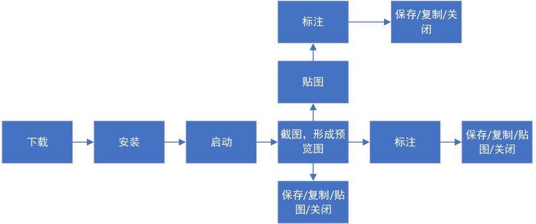

# Snipaste快速使用指南  （ Windows V2.11.3免费版）
## 1.软件说明
Snipaste是一款轻量的截图与标注工具。

## 2.使用流程示意图

## 3.常用功能快捷键
| 快捷键  |功能说明   |   
|---|---|
| F1  | 启动截图模式  |  
| Ctrl+1  | 启动延时截图  |  
|  F3/Ctrl+T | 将截图/剪贴板内容悬浮贴图  |  
| F4  | 贴图开启/关闭鼠标穿透  |   
| Ctrl + C  | 复制截图/标注内容至剪贴板  |   
| Ctrl + S  |  保存截图至本地 |   
| Esc  |  退出截图/标注/贴图模式 | 

## 4.下载及启动
- a.从[Snipaste官方网站](https://zh.snipaste.com/download.html)下载软件，保存至本地任意位置。
- b.解压文件夹后运行Snipaste.exe启动软件，启动后软件将最小化至系统托盘。
  > 首次启动将弹出新手引导，可跟随指引完成基础操作。

## 5.启动截图
- 通过快捷键F1启动。
- 点击任务栏该图标后启动截图。
  >当启动截图后，鼠标指标替换为十字准星。

### 选择截图范围
- 区域截图：按住鼠标左键拖动，框选需要截取的区域，松开鼠标后可通过截图区域下方的工具条对截图预览图进行操作。
- 窗口截图：移动鼠标至目标窗口且目标窗口高亮后，单击左键可截取整个窗口。
> 在选取截图范围时，可通过方向键/WASD键调整十字准星的位置。

>选取截图范围形成预览图后，可通过方向键/WASD键调整截图区域的位置。

## 6.贴图
贴图功能是将截图区域或截图预览图转化为图片，然后作为窗口置顶显示。
### 使用场景
将截图区域或截图预览图转化为窗口置顶显示，可做临时备忘、拼图、参考图、教程制作等；在使用过程中也可挖掘更多使用场景。
### 使用方式
- 在选取截图区域后，点击截图预览图下方工具条的贴图图标。

- 在选取截图区域后，按快捷键F3/Ctrl+T使用。
### 贴图调整
- **透明度调整**：按住Ctrl+鼠标滚轮调整贴图透明度。
- **旋转**：通过数字键1或2旋转贴图。
- **翻转**：通过数字键3或4水平/垂直翻转贴图。
- **缩放**：滑动滚轮或+/-键、拖动贴图窗口的边缘。
- **贴图重置**：中键单击。

## 7.标注
标注功能用于对截图预览图进行标注。

### 使用场景
- 选取截图区域后，对截图预览图进行标注。
- 对悬浮于屏幕的贴图进行标注。
> 对贴图进行标注时，若未显示工具条，可右键点击贴图在菜单栏选择显示工具条或在贴图处按SPACE键。

### 常见标注方式
如工具条所示，以下将按照从左到右的顺序说明标注类型。

- **矩形/椭圆**:圈选重点内容，可调整边框颜色、粗细、适合突出关键信息。
- **直线/箭头**：用于指向重点内容。
  - 按住Shift调整直线的方向，直线方向包括：水平、垂直和45°。
  - 按住Tab键可在箭头与直线之间切换。
- **画笔**：用于在截图预览图或贴图上添加笔画。
  - 上下滚动鼠标滚轮可调整画笔粗细。
- **记号笔**：用于在截图预览图或贴图上添加高亮条。
  - 上下滚动鼠标滚动可调整高亮条粗细。
- **马赛克/模糊**：对敏感信息进行打码。
- **文字**：添加步骤说明、备注，可修改字体、文字大小、文字颜色。
- **橡皮擦**：用于消除标记。
- **撤销**：用于撤销当前标注的标记。
- **返回上一步**：用于返回当前标注的前一个状态。
- **关闭截图**：用于退出截图。
- **贴图**：将截图预览图悬浮于屏幕。
- **保存**：保存截图预览图。
- **复制**：将截图预览图复制到剪贴板。

## 8.常见问题
**8.1 Snipaste无法运行/崩溃、没反应/配置无法保存···**   
相关问题请查阅[9.故障排除]。

**8.2 Snipaste一定要常驻后台吗？**   
若使用Snipaste的贴图功能，则需要常驻后台。

**8.3 贴图无法移动，右键菜单无响应？**  
这种情况通常是开启了鼠标穿透模式。
该功能默认是关闭的，如需开启，请前往首选项-控制-全局快捷键-鼠标穿透开关，设置快捷键。
当快捷键被触发后，光标所在位置的贴图会切换为鼠标穿透状态。

**8.4 标注时如何结束当前标注动作？**     
若不再需要使用当前标注方式或停止标注，可通过点击鼠标右键退出。

## 9.故障排除
**9.1 运行后遇到提示计算机中丢失api-ms-win-crt-runtime-|1-1-0.dll错误**   
请根据操作系统的版本（32位/64位），下载并安装相应的微软Visual C++ 2015可再发行组件包：32位/64位。

**9.2 运行桌面版时提示缺少hoedown.dll错误**   
请完整解压桌面版压缩包再运行Snipaste.exe，而非打开压缩包后直接打开Snipaste。

**9.3 运行后提示缺少Qt5\*\*\*.dll错误**   
请确保网站提供的压缩包的每个文件都在本地的程序目录中。
Snipaste版本升级时可能会增加新的dll，不建议通过手动替换.exe的方式升级，请尽可能使用在线更新。

**9.4 64位版Snipaste偶尔崩溃**   
原因未明，尝试使用32位版的Snipaste。

  

